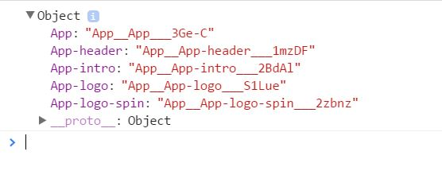

state management

state of component

state listener

# selective rendering

call to action


export default meaning'


Welcome.module.css WelcomeStyles.div is an inline style, so it is more powerful than index.css

# Updating version of node before `create-react-app`

1. Install `fnm` (fast node manager) 

    ```console
    root@ubuntu:~$ curl -fsSL https://fnm.vercel.app/install | bash
    ```

    Link to [`fnm`'s github](https://github.com/Schniz/fnm#using-a-script-macoslinux).

2. Run the following commands

    ```bash
    #!/usr/bin/bash

    eval "$(fnm env)"
    fnm --version
    nano .node-version # Enter the version you want to install with prefix `v`
    cat .node-version # Checking whether the version number is correctly stored
    fnm install
    fnm use 
    # Now, re-open the terminal to ensure the new version is displayed. If not, re-run the command just above

    node --version # The new version should now be displayed
    ```

# Creating React Application

After version of node has been updated...

```bash
#!/usr/bin/bash

npx create-react-app my-app
cd my-app

# This starts the live development server, which updates as changes are made
npm start

# OR

# Bundles the app into static files for production. This is done
npm run build
```

# Importing and Exporting in React

https://www.educative.io/answers/what-is-importing-and-exporting-in-react-js

Importing and exporting in React JS helps us write modular code, i.e., splitting code into multiple files. 

- Importing allows using contents from another file, 
- Exporting makes the file contents eligible for importing. 

The basic idea behind imports and exports is to exchange contents between several JavaScript files.

> ***NOTE:*** We can also import CSS files into Javascript in order to use the styles on JSX elements

## Exporting

Let’s use a file `name.js` with an object `person` and `name` as an attribute.

Export the object in the current file to make this object usable in another file.
```js
//name.js

const person = {
    name:'Kedar'
}

export default person;
```
The snippet `export default person` informs us that we will receive the person object by-default whenever we import from `name.js`.

We can also export multiple elements from a file. 

Let’s consider an `info.js` file where we will individually export the `age` and the `birth_country` of the person above.

```js
//info.js

export const age = 23;
export const birth_country = "India"
```

Now that you have learned about exporting, let’s look at importing.

# Importing

Similar to exporting, there are two ways to import.

- Importing from default exports.
- Importing from named exports.

For example, we are creating a file `app.js`, and we want to use the contents from `name.js` and `info.js`.

- When importing from `name.js`, a default export can be done as shown below.

    ```js
    import person from './name.js'
    ```
    Since we have a default export, importing anything from that file will provide us with a person object.


- For imports from the `info.js` file, we will import from two different constants.

    Therefore, we use `{}` to precisely target specific things from that file.
    
    These are called *named exports*, as we import them by their name.

    ```js
    import {age} from './info.js'
    import {birth_country} from  info.js'
    ```
    
    As shown below, you can also use aliases while importing in the named exports.

    ```js
    import {birth_country as bc} from 'info.js'
    ```

    You will frequently be using these import and export features throughout React.


## Using CSS modules in React

Files with names of the format `[name].module.css` are modular CSS files, whose CSS properties are locally scoped. Even if we `import` them as regular `.css` files and try to use their styles, they won't be applied.

Instead we need to `import` them as named-imports. 

### CSS module loader object

This creates a CSS module loader object in JS (TODO: What exactly is this?), which has the class/id names as keys and the uniquely generated CSS classes as values.

Suppose we have the following `.css` file, named `App.module.css`:

```css
.App {
  text-align: center;
}

.App-logo {
  animation: App-logo-spin infinite 20s linear;
  height: 80px;
}

.App-header {
  background-color: #222;
  height: 150px;
  padding: 20px;
  color: white;
}

.App-intro {
  font-size: large;
}
```

We import this into our `.js` file

```js
import AppStyles from './App.module.css'

console.log(AppStyles)
```

The output of the `console.log` statement is:



Verifying what the CSS Module Loader Object contains. These classes are unique, so no styling conflicts will occur with other `.css` or `.module.css` files.

### Using IDs in `.module.css` files

We have the ability to use not only CSS classes but IDs as well in modular css files.

Separate CSS module loader objects are generated for classes and IDs, so make sure that you use `className` and `id` attributes consciously. 

The regular `.` operator is used to access a specific CSS class or ID in both cases, because they are objects in both cases.

For the following `.css` file, named `Welcome.module.css`:

```css
.div{
    text-align: left;
}

#div {
    text-align: right;
}
```


```js
import WelcomeStyles from './Welcome.module.css'

console.log(WelcomeStyles);

function Welcome() {
  return (
    <div>
      {/* <div className={`${WelcomeStyles.div}`}>Welcome</div> */}
      <div className={`${WelcomeStyles.div}`}>Welcome</div>
      <div id={`${WelcomeStyles.div}`}>Welcome</div>
    </div>
  )
}
```

Take a look at [this](https://www.triplet.fi/blog/practical-guide-to-react-and-css-modules/) practical guide on CSS modules for a more in-depth understanding.

# Terminologies in React

- `props` – a way to pass data between components. They looks like HTML attributes when you send them, and arrive as an object in the form of `this.props`.
- `refs` – how you snag data out of the form element we created.
- `keys` – a way to uniquely identify a component when it’s repeated. We’re repeating comments here (there can be multiple comments), so if we were to have functionality that could change any of them, having a key is what makes React efficient (it can just replace that single comment instead of all of themcreating grid design css
- ).

# Elements vs. Components in React

https://ui.dev/react-elements-vs-react-components
